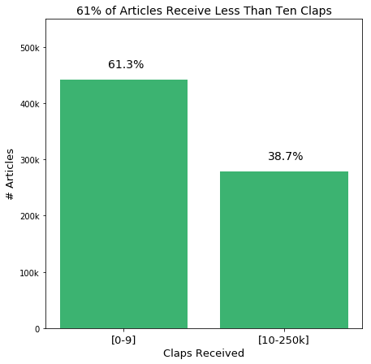
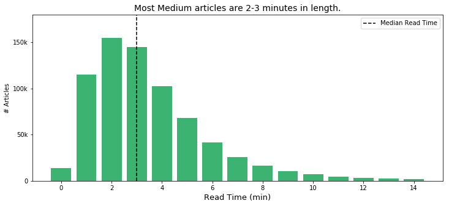
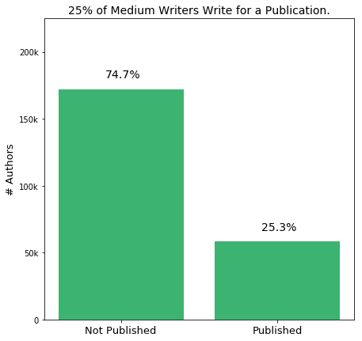
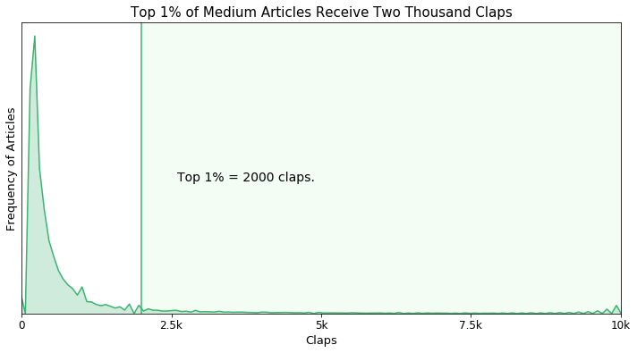
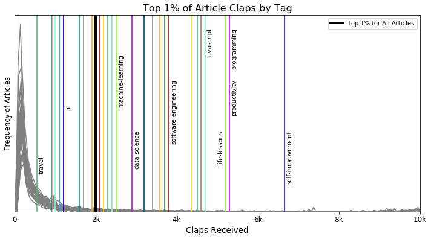
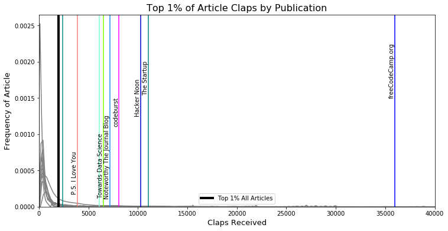
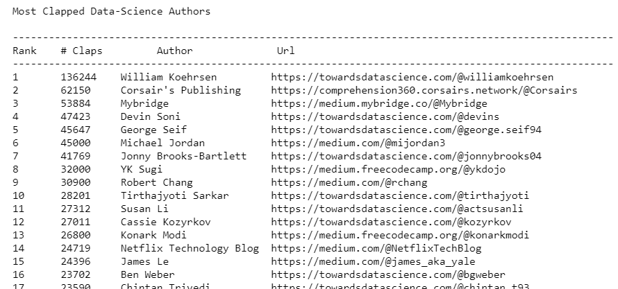

# Analyzing_Medium

## What is Medium?

<a href="https://medium.com/">Medium</a> is a blogging platform where writers and readers share their ideas. With a strong following in the tech community, it is a place where people can come to learn from professionals and industry experts. I began writing on Medium very recently, inspired to write about data-science and machine learning. For more information, check out my writing <a href="https://medium.com/@harrisonjansma">here.</a>

# This Project
In this project I collected data on 1.4 million unique Medium stories from 95 of the most popular writing subjects. I used this data to answer the following questions.
1. What do I need to know about Medium as a writer and as a reader? (<a href="https://github.com/harrisonjansma/Analyzing_Medium/blob/master/Medium_EDA.ipynb">source</a>)
2. Who are the top Data-Science writers on Medium? (<a href="https://github.com/harrisonjansma/Analyzing_Medium/blob/master/Medium_Author_Leaderboard.ipynb">source</a>)
3. How can Medium writer's measure the performance of their stories? How can they compare their performance to that of similar writers? (<a href="https://github.com/harrisonjansma/Analyzing_Medium/blob/master/Medium_EDA.ipynb">source</a>)

After I answered these questions I wrote a story detailing my findings in Medium's largest tech publication, freeCodeCamp (496k subscribers). The full article can be found <a href="https://medium.freecodecamp.org/how-i-analyzed-a-million-medium-articles-to-learn-how-many-claps-great-stories-get-d688cf92759f">here.</a> I then published the full data-set for public use by the Medium community. All 1.4 million data points are freely available on Kaggle. My introductory article, describing the dataset and how I collected it, can be found <a href="https://towardsdatascience.com/i-just-published-a-massive-dataset-of-medium-stories-heres-the-link-to-get-it-889bab324138">here.</a>

This repository is a collection of everything I found while analyzing the Medium data. For a list of key findings look in the next section. 

# My Findings
 

## 1. Most Stories on Medium receive very little reader engagement.

 

## 2. Stories are shorter in length. (2-3 Minutes)

 

## 3. Most authors only wrote one story, and a quarter were published in a publication.

 

## 4. The top 1% of stories received more than two thousand claps.

 

## 5. Authors can compare their stories to the top 1% of stories in their writing-topic.

 

## 6. The most-clapped stories on freeCodeCamp far outrank other, larger, publications.

 

## 7. <a href="https://github.com/harrisonjansma/Analyzing_Medium/blob/master/Medium_Author_Leaderboard.ipynb">Here</a> are the top 100 most-clapped data-science writers on Medium of the last year. 

