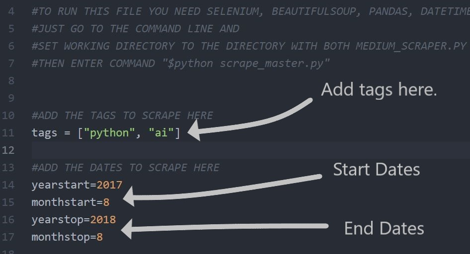
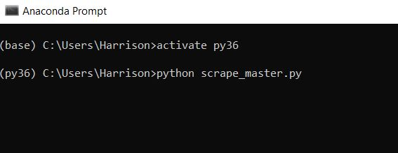
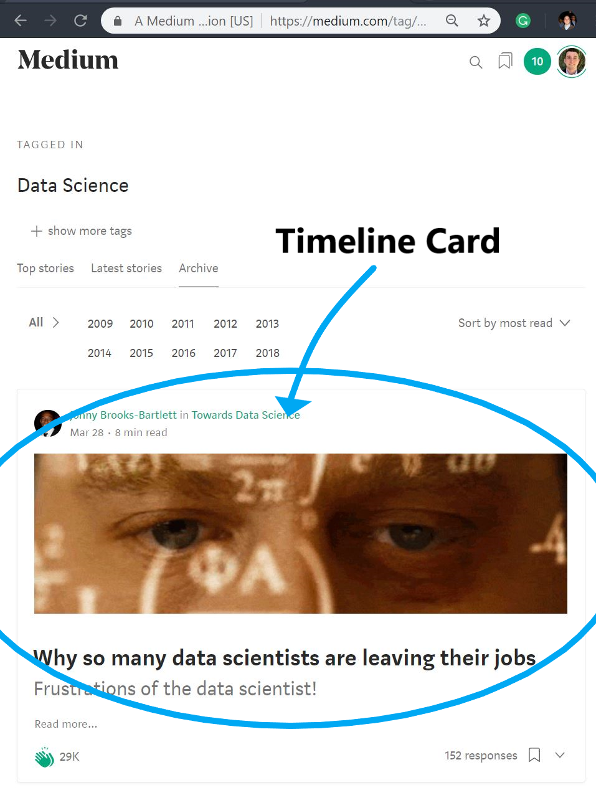
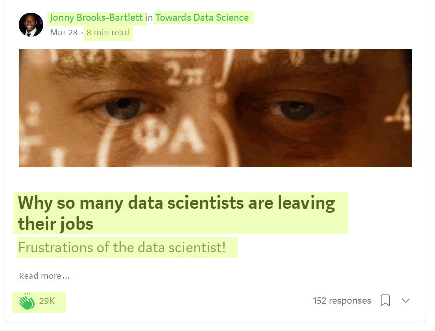

# Analyzing_Medium

## What is Medium?

<a href="https://medium.com/">Medium</a> is a blogging platform where writers and readers share their ideas. With a strong following in the tech community, it is a place where people can come to learn from professionals and industry experts. I began writing on Medium very recently, inspired to write about data-science and machine learning. For more information, check out my writing <a href="https://medium.com/@harrisonjansma">here.</a>

## This Project

This repository consists of a Selenium scraper that I used to scrape one million articles from the Medium archive pages in order to answer the question, "how many claps do exceptional articles receive?" The results of my analysis can be found in the <a href="https://github.com/harrisonjansma/Analyzing_Medium/blob/master/Medium_EDA.ipynb">Medium_analysis.ipynb</a> notebook. I also plan on writing a Medium article to convey my findings to the writers of Medium.

# Scraping Medium with this Repository

To use this scraper to collect your own data, you simply have to clone this repository to your local drive, then acquire a few more tools to make the scraper work. 

First you will need to download the <a href="http://chromedriver.chromium.org/downloads">Chrome Driver</a> and place it in the same directory as the "scrape_master.py" and "medium_scraper.py" files. You will also need the following Python libraries you will need: Selenium, Pandas, BeautifulSoup.

Before you can run the scraper, you need to specify the tags and range-of-dates to scrape in the "scrape_master.py" file.

 

 

Afterwards you should be able to execute a scrape of multiple Medium tags for any range of dates by simply calling $python scrape_master.py
 

## How it works.

This scraper pulls data from Medium's archive pages. Each archive page is associated to a story-tag and is a <b>collection of Medium timeline cards organized by date.</b>
 

<h3 align="center"> Image of the "<a href="https://medium.com/tag/data-science/archive">data-science</a>" Archive</h3>

## Structure of the Scraped Data
- Title -title of article on timeline card
- Subtitle  -subtitle of article on timeline card
- Image (yes/no)-whether the article has a preview image on its timeline card
- Author -writer of the story
- Publication - the name of the publication the article may have been posted in
- Year - Month - Day-date the article was published
- Tag - text
- Reading Time- Time to read the article
- Claps-Number of claps the article received
- Comment (yes/no)-whether the entry is a comment on another article
- Story Url-link to story
- Author URL-link to Author's Medium homepage

 
 <h3 align="center">Example of Data Scraped from a Timeline Card</h3>

